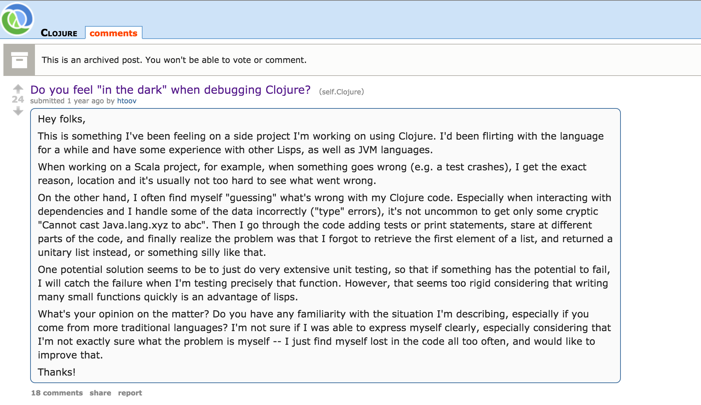
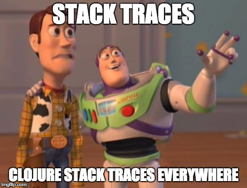
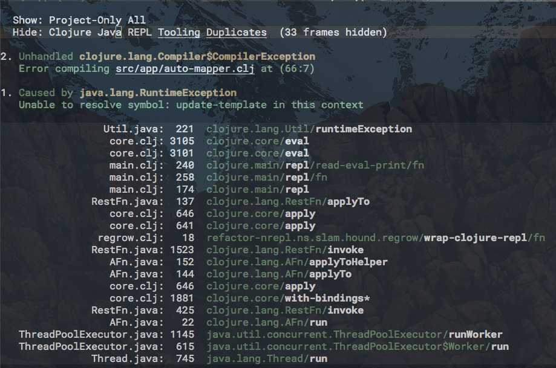
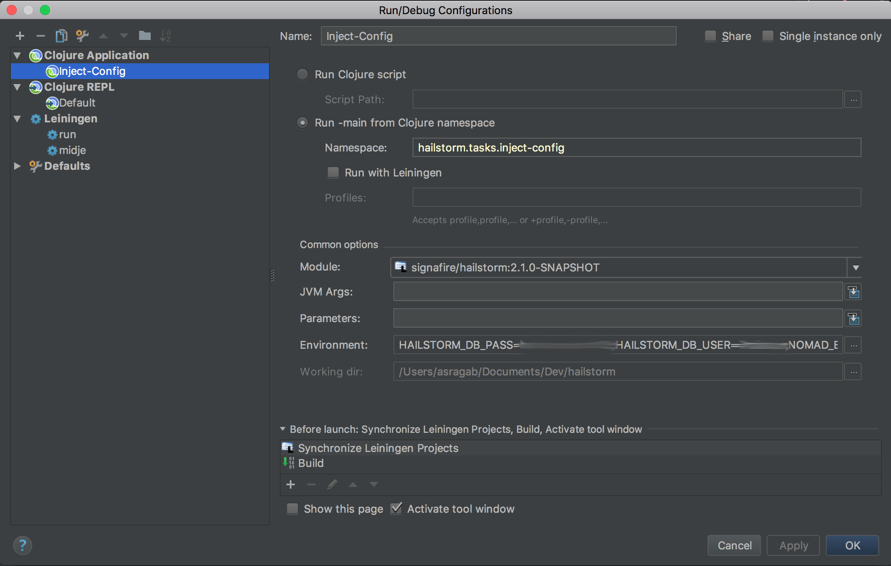
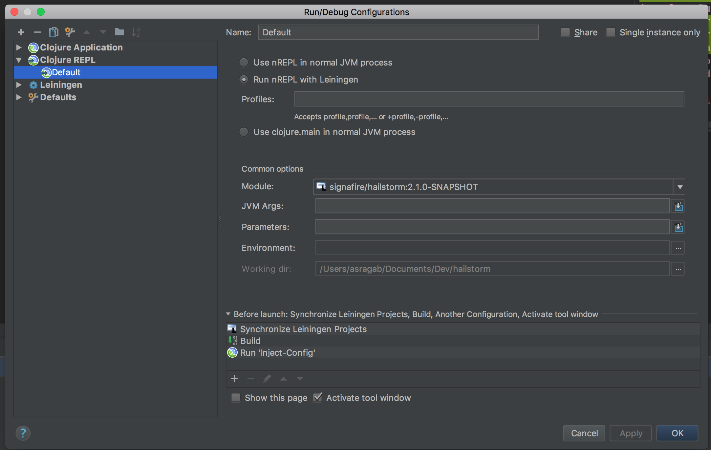
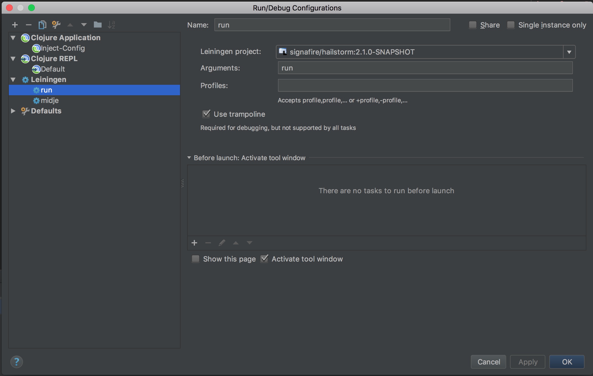

#### Debugging in Clojure
<br>
<span style="color:gray">Finding Light in the Darkness</span>
<br>
<span style="color:gray">using the repl, Emacs and Cursive</span>

---
### Darkness


+++
### Opaque Errors

`No implementation of method: :alter-name of protocol: 'camel-snake-kebab.internals.alter-name/AlterName found for class: nil, compiling:(/private/var/folders/hn/tgwyrdmj1/T/form-init2789214926070543937.clj:1:125)`

+++


+++
[Show Stack Trace](https://outofsingularity.wordpress.com/2016/04/15/clojure-lein-run-and-obscure-error-messages/)

The error was that a command line parameter wasn't passed

+++
### Execution Ergonomics

- To REPL or not to REPL
- The use and abuse of config for life
- Lein again!

---
### [Spyscope](https://github.com/dgrnbrg/spyscope)
 `~/.lein/profiles.clj` 

```clojure
{:user {:repl-options {:init (set! *print-length* 150)}
        :dependencies [[spyscope "0.1.5"]]
        :injections   [(require 'spyscope.core)]}
 :dev  {:dependencies [[proto-repl "0.3.1"]
                       [proto-repl-charts "0.3.1"]
                       [alembic "0.3.2"]]}}
```

@[2-3](Dependencies and Injections to add to user profile)

+++
### Reader Tags

`#spy/p - pretty print`
```clojure
user=> (take 20 (repeat #spy/p (+ 1 2 3)))
6
(6 6 6 6 6 6 6 6 6 6 6 ...)
```
@[2](just a pretty printer)

+++
`#spy/d - debug output`
```clojure
(defn foo
  "I don't do a whole lot."
  [x]
  (println #spy/d x "Hello, World!"))
  
spyscope.core$pretty_render_value.invokeStatic(core.clj:24) x => 10
10 Hello, World!
 ```
 @[4,6](Evaluates the subsequent form, and provides the file name where the error occured)

+++
`#spy/t - trace-query`
```clojure
(defn call-future [p] (future (Thread/sleep 10000) 
                       #spy/t (+ 4 
                                (:value {:value p 
                                         :something "else"}))))

user=>(use `spyscope.repl)
nil
user=>(trace-query)
spyscope.core$pretty_render_value.invokeStatic(core.clj:24) (+ (:value {:value p, :something "else"})) => 100
----------------------------------------
spyscope.core$pretty_render_value.invokeStatic(core.clj:24) (+ (:value {:value p, :something "else"})) => 100
----------------------------------------
spyscope.core$pretty_render_value.invokeStatic(core.clj:24) (+ 4 (:value {:value p, :something "else"})) => 104
nil
```
@[2](Enable trace via #spy/t)
@[6](in repl use or require `spyscope.repl`)
@[8](call trace-query)
@[13](by default trace query will print out current generation)

---
### Cider Debug

1. `#dbg` and `#break` before a form
  - The difference is that `dbg` will break at the subsequent form and everything inside it

2. `, d b` for spacemacs or `C-u C-M-x` for emacs, to instrument entire top level `defn`
  - To "deinstrument" function, just revaluate the form as your keybindings dictate in spacemacs that would be `, e f`

+++
### Conditional Breakpoints

```clojure
(defn do-stuff [x y z]
  (let [file (slurp "./README.md")
        hello (take 10 file)]
    #dbg ^{:break/when (some? file)}
    (+ 10 (count hello))))
```
@[4](can provide conditions to break on by adding metadata to reader macro)

+++
### Stacktrace Buffers in Cider

- You can filter out parts of the stacktraces that are in your way

---
### Cursive
1. REPL vs. Application vs. Lein Task
2. Managing Configs
3. Stepping In 

+++
### REPL vs. Application vs. Lein Task

- Cursive uses the nREPL architecture ("Network REPL")
  - It works like most nREPLs with a few nifty features

- In Cursive the Application Configuration for Clojure can be used to run arbitrary processes that finish
  - (See inject-config)

- Lein Task
  - You can run a lein task directly from IntelliJ

+++
### Managing Configs
Demo Adding Configs via Copy/Paste

+++
### Application

Demo...

+++
### REPL

Demo...

+++
### Lein Task

Demo...

---
### References
[Notes on debugging Clojure](http://eli.thegreenplace.net/2017/notes-on-debugging-clojure-code/)
<br>
[Debugging in Clojure Tools](http://brownsofa.org/blog/2014/08/03/debugging-in-clojure-tools/)
<br>
[Repl Driven Development (video)](https://vimeo.com/223309989)
<br>
[Cursive User Guide](https://cursive-ide.com/userguide/)
 
